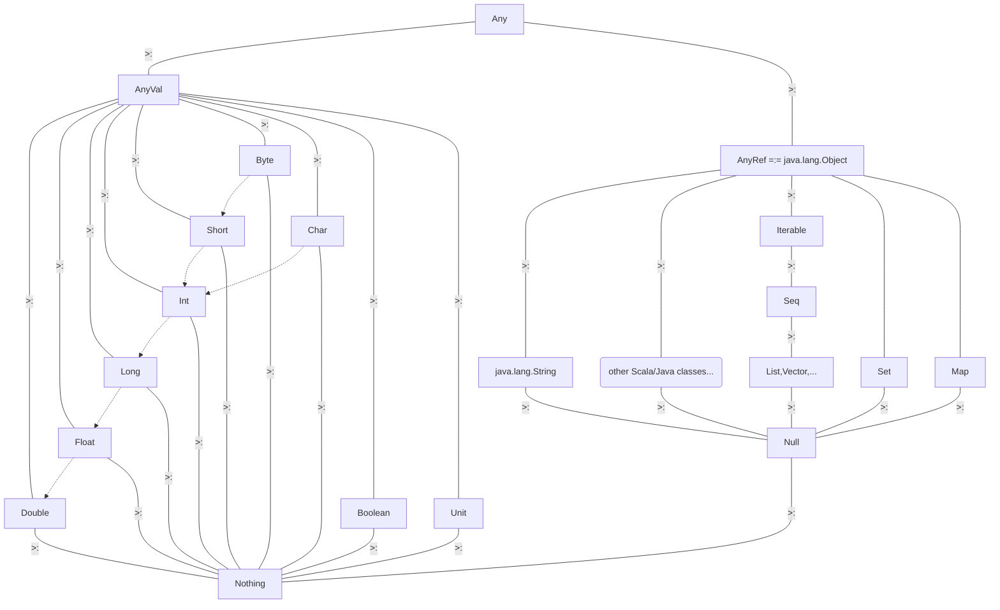

This cheat sheet is a heavily modified version of  [https://github.com/lampepfl/progfun-wiki/blob/gh-pages/CheatSheet.md](https://github.com/lampepfl/progfun-wiki/blob/gh-pages/CheatSheet.md). Extra information is taken from the lectures and various links online.

<!-- TOC -->

- [Evaluation Rules](#evaluation-rules)
- [Higher order functions](#higher-order-functions)
- [Currying](#currying)
- [Classes](#classes)
    - [Extension Methods Scala 3](#extension-methods-scala-3)
        - [Scala 2 Equivalent: Implicit classes](#scala-2-equivalent-implicit-classes)
    - [Companion Objects](#companion-objects)
    - [Auxilliary Constructors](#auxilliary-constructors)
- [End markers](#end-markers)
- [Operators](#operators)
- [Class hierarchies](#class-hierarchies)
- [Class Organization](#class-organization)
- [Type Parameters](#type-parameters)
- [Variance](#variance)
    - [Mutable arrays are not covariant](#mutable-arrays-are-not-covariant)
    - [Lists are covariant; this means extra work and caution is needed](#lists-are-covariant-this-means-extra-work-and-caution-is-needed)
    - [Classes, Traits, Generics, Polymorphism](#classes-traits-generics-polymorphism)
- [Pattern Matching](#pattern-matching)
    - [Options](#options)
    - [Pattern Matching in Anonymous Functions](#pattern-matching-in-anonymous-functions)
- [Collections](#collections)
    - [Base Classes](#base-classes)
    - [Immutable Collections](#immutable-collections)
    - [Mutable Collections](#mutable-collections)
    - [Examples](#examples)
- [Pairs similar for larger Tuples](#pairs-similar-for-larger-tuples)
- [Functions as a class](#functions-as-a-class)
    - [Functions and methods are different](#functions-and-methods-are-different)
- [Ordering with using clauses](#ordering-with-using-clauses)
- [Enums Algebraic Data Types](#enums-algebraic-data-types)
- [For-Comprehensions](#for-comprehensions)
    - [Translation Rules](#translation-rules)
    - [Example](#example)

<!-- /TOC -->
## Evaluation Rules

- Call by value: evaluates the function arguments before calling the function
- Call by name: evaluates the function first, and then evaluates the arguments if need be

<!-- code -->
```scala
    def example = 2      // evaluated when called
    val example = 2      // evaluated immediately
    lazy val example = 2 // evaluated once when needed

    def square(x: Double)    // call by value
    def square(x: => Double) // call by name
    def myFct(bindings: Int*) =  ...  // bindings is a sequence of int, containing a varying # of arguments
```

## Higher order functions

These are functions that take a function as a parameter or return functions.

```scala
    // sum takes a function that takes an integer and returns an integer then
    // returns a function that takes two integers and returns an integer
    def sum(f: Int => Int): (Int, Int) => Int =
      def sumf(a: Int, b: Int): Int = f(a) + f(b)
      sumf

    // variant with anonymous function
    def sum(f: Int => Int): (Int, Int) => Int =
      (a,b) => f(a) + f(b)

    // desugars to above. 
    // Its type is (Int => Int) => (Int, Int) => Int
    def sum(f: Int => Int)(a: Int, b: Int): Int =  f(a) + f(b)
```

## Currying

Converting a function with multiple arguments into a function with a
single argument that returns another function.

```scala
    def f(a: Int, b: Int): Int // uncurried version (type is (Int, Int) => Int)
    def f(a: Int)(b: Int): Int // curried version (type is Int => Int => Int)
```

To curry an existing function :

```scala
    val f2: (Int, Int) => Int = f // uncurried version (type is (Int, Int) => Int)
    val f3: Int => Int => Int = f2.curried // transform it to a curried version (type is Int => Int => Int)
    val f4: (Int, Int) => Int = Function.uncurried(f3) // go back to the uncurried version (type is (Int, Int) => Int)
```

A partially applied function is more general, as it may not take only a single argument.

## Classes

The `class` keyword creates both a `type` and a `constructor` method which runs the body of the class.

```scala
    class MyClass(x: Int, val y: Int,
                          var z: Int):        // Defines a new type MyClass with a constructor
                                              // x will not be available outside MyClass
                                              // val will generate a getter for y
                                              // var will generate a getter and a setter for z
      require(y > 0, "y must be positive")    // precondition, triggering an IllegalArgumentException if not met
      def this (x: Int) =  ...                // auxiliary constructor
      def nb1 = x                             // public method computed every time it is called
      private def test(a: Int): Int =  ...    // private method
      val nb3 = x + y                         // computed only once
      override def toString =                 // overridden method
          x + ", " + y
    end MyClass

    new MyClass(1, 2, 3) // creates a new object of type
```

- `this` references the current object. In fact 'simple names' like `nb3` desugar to `this.nb3`.
- `assert(<cond>)` issues `AssertionError` if condition
is not met. `require(<cond>)` throws a new `IllegalArgumentException`. See [`scala.Predef`](https://www.scala-lang.org/api/current/scala/Predef$.html) for `require`, `assume` and `assert`.

### Extension Methods (Scala 3)

- can add new members of the class but cannot override
- cannot refer to other class members via `this`

``` scala
extension (myc: MyClass)
  def yAdder(myc2: MyClass) = myc.y + myc2.y
```

is functionally the same as if `yAdder` was defined in the class `MyClass` normally:

```scala
    class MyClass(x: Int, val y: Int,
                          var z: Int):  
    // ...
    def yAdder(myc2: MyClass) = this.y + myc2.y
```

These can be put in the companion object or anywhere in scope via `import`.

#### Scala 2 Equivalent: Implicit classes

```scala
object MyExtensions {
  implicit class RichInt(val i: Int) extends AnyVal {
    def square = i * i
  }
}
```

The good thing about Implicit Classes is it is easier to mechanically see the implementation. Its clear that `5.square` is converted by the compiler to `RichInt(5).square`, which is a single line. (However it should be said that this doesn't look like how even [Scala 2 implemented RichInt?](https://stackoverflow.com/questions/7669627/scala-source-implicit-conversion-from-int-to-richint?rq=1))

### Companion Objects

Recall the class body is run during construction. So without an instance, the methods cannot be called. To skip this, in the same source file, put the methods in the companion object,

```scala
    object MyClass:  
      def zero = MyClass(0,0,0)
    MyClass.zero // compiles
```

 These emulate static methods of Java: in Java, a static method is a method that belongs to a class rather than an instance of a class. This means you can call a static method without creating an object of the class. Static methods are sometimes called class methods.

### Auxilliary Constructors

This is a second constructor defined by overloading the method `this`.

## End markers

When the body of a class, object, trait, method or value becomes long, visually
inspecting where it ends might become challenging.
In these situations, it is possible to explicitly signal to the reader that the body
is over using the `end` keyword with the name of the definition:

```scala
    class MyClass(a: Int, b: String):
      // body
    end MyClass // can replace `class` with object,trait,def,val...

    def myMethod(name: String): Unit =
      println(s"Hello $name")
    end myMethod

    val myVal: Int =
      42
    end myVal
```

## Operators

`1 + 3` is the same as calling `1.+(3)`.

Operator (i.e. function) names can be alphanumeric, symbolic (e.g. `x1`, `*`, `+?%&`, `vector_++`, `counter_=`)

The precedence of an operator is determined by its first character, with the following increasing order of priority:

    (all letters)
    |
    ^
    &
    < >
    = !
    :
    + -
    * / %
    (all other special characters)

The associativity of an operator is determined by its last character: Right-associative if ending with `:`, Left-associative otherwise.

Note that assignment operators have lowest precedence. (Read Scala Language Specification 2.9 sections 6.12.3, 6.12.4 for more info)

Methods that begin with an alphabet are not infix by default. You will need to write

```scala
infix def myop(x: Int,y: Int) = x + y
x myop y // no error
```

## Class hierarchies

```scala
    abstract class TopLevel:     // abstract class
      def method1(x: Int): Int   // abstract method
      def method2(x: Int): Int =  ...
    end TopLevel

    class Level1 extends TopLevel:
      def method1(x: Int): Int = ...
      override def method2(x: Int): Int = ... // TopLevel's method2 needs to be explicitly overridden
    end Level1

    object MyObject extends TopLevel:
      ...  // defines a singleton object. No other instance can be created
```

To create a runnable application in Scala:

```scala
    @main def run(args: Array[String]) =
      println("Hello world")
```

or

```scala
    object Hello extends App:
      println("Hello World")
```

## Class Organization

- Classes and objects are organized in packages (`package myPackage`).

- They can be referenced through import statements (`import myPackage.MyClass`, `import myPackage.*`,
`import myPackage.{MyClass1, MyClass2}`, `import myPackage.{MyClass1 => A}`)

- They can also be directly referenced in the code with the fully qualified name (`new myPackage.MyClass1`)

- All members of packages `scala` and `java.lang` as well as all members of the object `scala.Predef` are automatically imported.

- Traits are similar to Java interfaces, except they can have non-abstract members:

```scala
        trait Planar:
    ...
        class Square extends Shape with Planar
```

- In Scala 2, Traits could not have parameters while abstract classes could. In Scala 3 both can, so it is more of a semantic difference? And you cannot inherit from mutliple classes (abstract or not).
- General object hierarchy:



- simple names e.g. `Char` expand to `scala.Char`.
- Dotted arrow means an implicit conversion is automatically in scope.
- `scala.Any` base type of all types. Has methods `hashCode` and `toString` that can be overridden
- `scala.AnyVal` base type of all primitive types. (`scala.Double`, `scala.Float`, etc.)
- `scala.AnyRef` base type of all reference types. (alias of `java.lang.Object`, supertype of `java.lang.String`, `scala.List`, any user-defined class)
- `scala.Null` is a subtype of any `scala.AnyRef` (`null` is the only instance of type `Null`), and `scala.Nothing` is a subtype of any other type without any instance.
  - At the same time, exceptions are all of type `Nothing`.
- Iterables are case classes, and hence can be pattern matched.
- The different Seqs differ in performance or memory usage (e.g. `Vector` is an `IndexedSeq` with O(1) lookup. But `List` is only a `LinearSeq`.)
- The chart is nonexhaustive; e.g. `Option <: IterableOnce`, not `Iterable` (but [there is](https://github.com/scala/scala/blob/6c68c2825e893bb71d6dc78465ac8c6f415cbd93/src/library/scala/Option.scala#L19) an implicit conversion available).
- There are also literal types: Every literal is also a type, e.g. 1. Its only instance is the literal itself. You can use this to enforce that the argument *must* be 1.
- Union types: `A|B`, which is a supertype of `A` and `B`. But there is no OO overhead.

## Type Parameters

Conceptually similar to C++ templates or Java generics. These can apply to classes, traits or functions.

```scala
    class MyClass[T](arg1: T):
      ...

    MyClass[Int](1)
    MyClass(1)   // the type is being inferred, i.e. determined based on the value arguments
```

It is possible to restrict the type being used, e.g.

```scala
    def myFct[T <: TopLevel](arg: T): T = ... // T must derive from TopLevel or be TopLevel
    def myFct[T >: Level1](arg: T): T = ...   // T must be a supertype of Level1
    def myFct[T >: Level1 <: TopLevel](arg: T): T = ...
```

- Simple types can be inferred by the compiler.
- Types are erased after compilation, so there can be no runtime checking of types.

## Variance

Given `A <: B`

If `C[A] <: C[B]`, `C` is covariant

If `C[A] >: C[B]`, `C` is contravariant

Otherwise C is nonvariant (also called invariant, which is quite painful to read as a mathematician)

```scala
    class C[+A]  // C is covariant
    class C[-A]  // C is contravariant
    class C[A]   // C is nonvariant
```

For a function, if `A2 <: A1` and `B1 <: B2`, then `A1 => B1 <: A2 => B2`.

Functions must be contravariant in their argument types and covariant in their result types, e.g.

```scala
    trait Function1[-T, +U]:
      def apply(x: T): U
    // Variance check is OK because T is contravariant and U is covariant

    class Array[+T]:
      def update(x: T) // variance checks fails
```

(This matches with how a mathematical map transforms under change of variables. The simplest example: if $y=x^2$ then adding 1 to $y$ to get $x^2+1$ moves the graph up but adding 1 to $x$ to get $(x+1)^2$ moves the graph left (despite bigger numbers being on the right; this is covariance).)

### Mutable arrays are not covariant

``` scala
class IntSet
class Singleton(s: Int) extends IntSet
class Empty extends IntSet // Observe that Singleton, Empty <: IntSet. 
// If arrays were covariant, we would have Array[Singleton] <: Array[IntSet].
val a: Array[Singleton] = Array(Singleton(1))
val b: Array[IntSet] = a // compiler errors here.
b(0) = Empty()
val s: NonEmpty = a(0)
```

Variance Checks via the Liskov Substitution Principle: If `A<:B` then everything one can do with a value of type `B`, one should also be able to do with a value of type `A`.

### Lists are covariant; this means extra work and caution is needed

`List` methods `prepend`, `indexOf`, and `contains` need lower type bounds to pass variance checks:

```scala
trait MyList[+T]: // +T means covariant in T
  def prepend(x: T): MyList[T] = ::(x,xs) // cannot compile
  def prepend[U :> T](x: U): MyList[U] = ::(x,xs) // compiles
case class Nil extends MyList[Nothing]
case class ::[+T](head: T, tail: MyList[T]) extends MyList[T]
```

It is natural to prepend and have a `List[Apple]` turn into a `List[Fruit]`. But this also means that `List(1).indexOf("1")` passes the compiler check.

- Covariant type parameters can be lower bounds of function arguments. Contravariant ones can be upper bounds.
  
Find out more about variance in [lecture 4.4](https://class.coursera.org/progfun-2012-001/lecture/81) and [lecture 4.5](https://class.coursera.org/progfun-2012-001/lecture/83).

### Classes, Traits, Generics, Polymorphism

Subtypes and generics (the `T` in `List[T]`) are forms of polymorphism: broadly, this is the ability to have one thing be multiple other things at once.

- You can inherit from only one class, but multiple traits.

 ```scala
 class A extends myClass with myTrait1 with myTrait2
 // or
 class A extends myClass, myTrait1, myTrait2
 ```

 `sealed trait`, `final class`...`opaque` ??

## Pattern Matching

Pattern matching is used for decomposing data structures:

```scala
    unknownObject match
      case MyClass(n) => ...
      case MyClass2(a, b) => ...
```

Here are a few example patterns

```scala
    (someList: List[T]) match
      case Nil => ...          // empty list
      case x :: Nil => ...     // list with only one element
      case List(x) => ...      // same as above
      case x :: xs => ...      // a list with at least one element. x is bound to the head,
                               // xs to the tail. xs could be Nil or some other list.
      case 1 :: 2 :: cs => ... // lists that starts with 1 and then 2
      case (x, y) :: ps => ... // a list where the head element is a pair
      case _ => ...            // default case if none of the above matches
```

The last example shows that every pattern consists of sub-patterns: it
only matches lists with at least one element, where that element is a
pair. `x` and `y` are again patterns that could match only specific
types.

### Options

Pattern matching can also be used for `Option` values. Some
functions (like `Map.get`) return a value of type `Option[T]` which
is either a value of type `Some[T]` or the value `None`:

```scala
    val myMap = Map("a" -> 42, "b" -> 43)

    def getMapValue(s: String): String =
      myMap get s match
        case Some(nb) => "Value found: " + nb
        case None => "No value found"

    getMapValue("a")  // "Value found: 42"
    getMapValue("c")  // "No value found"
```

Most of the times when you write a pattern match on an option value,
the same expression can be written more concisely using combinator
methods of the `Option` class. For example, the function `getMapValue`
can be written as follows:

```scala
    def getMapValue(s: String): String =
      myMap.get(s).map("Value found: " + _).getOrElse("No value found")
```

### Pattern Matching in Anonymous Functions

Pattern matches are also used quite often in anonymous functions:

```scala
    val options: List[Option[Char]] = Some('a') :: None :: Some('b') :: Nil
    val chars: List[Char] = options.map(o => o match {
      case Some(ch) => ch
      case None => 'z'
    })
```

Instead of `o => o match { case ... }`, you can simply write `{case ...}`, so the above example becomes more concise:

```scala
    val chars: List[Char] = options.map {
      case Some(ch) => ch
      case None => 'z'
    }
```

## Collections

Scala defines several collection classes:

### Base Classes

- [`Iterable`](https://www.scala-lang.org/api/current/scala/collection/Iterable.html) (collections you can iterate on)
- [`Seq`](https://www.scala-lang.org/api/current/scala/collection/Seq.html) (ordered sequences)
- [`Set`](https://www.scala-lang.org/api/current/scala/collection/Set.html)
- [`Map`](https://www.scala-lang.org/api/current/scala/collection/Map.html) (lookup data structure)

### Immutable Collections

- [`List`](https://www.scala-lang.org/api/current/scala/collection/immutable/List.html) (linked list, provides fast sequential access)
- [`Stream`](https://www.scala-lang.org/api/current/scala/collection/immutable/Stream.html) (same as List, except that the tail is evaluated only on demand)
- [`Vector`](https://www.scala-lang.org/api/current/scala/collection/immutable/Vector.html) (array-like type, implemented as tree of blocks, provides fast random access)
- [`Range`](https://www.scala-lang.org/api/current/scala/collection/immutable/Range.html) (ordered sequence of integers with equal spacing)
- [`String`](http://docs.oracle.com/javase/1.5.0/docs/api/java/lang/String.html) (Java type, implicitly converted to a character sequence, so you can treat every string like a `Seq[Char]`)
- [`Map`](https://www.scala-lang.org/api/current/scala/collection/immutable/Map.html) (collection that maps keys to values)
- [`Set`](https://www.scala-lang.org/api/current/scala/collection/immutable/Set.html) (collection without duplicate elements)

### Mutable Collections

Most of the immutable collections above have a mutable counterpart, e.g.:

- [`Array`](https://www.scala-lang.org/api/current/scala/Array.html) (Scala arrays are native JVM arrays at runtime, therefore they are very performant)
- Scala also has mutable maps and sets; these should only be used if there are performance issues with immutable types

### Examples

NOTE: For the correct code convention of using postfix or not, read [this](https://docs.scala-lang.org/style/method-invocation.html)

```scala
    val fruitList = List("apples", "oranges", "pears")
    // Alternative syntax for lists
    val fruit = "apples" :: ("oranges" :: ("pears" :: Nil)) // parens optional, :: (pronounced cons) is right-associative
    fruit.head   // "apples"
    fruit.tail   // List("oranges", "pears")
    val empty = List()
    val empty = Nil

    val nums = Vector("louis", "frank", "hiromi")
    nums(1)                     // element at index 1, returns "frank", complexity O(log(n))
    nums.updated(2, "helena")   // new vector with a different string at index 2, complexity O(log(n))

    val fruitSet = Set("apple", "banana", "pear", "banana")
    fruitSet.size    // returns 3: there are no duplicates, only one banana

    val r: Range = 1 until 5 // 1, 2, 3, 4
    val s: Range = 1 to 5    // 1, 2, 3, 4, 5
    1 to 10 by 3 // 1, 4, 7, 10
    6 to 1 by -2 // 6, 4, 2

    val xs = (1 to 10).toList // convert range to list
    
    val s = (1 to 6).toSet // convert range to set
    s.map(_ + 2) // adds 2 to each element of the set

    val s = "Hello World"
    s filter (c => c.isUpper) // returns "HW"; strings can be treated as Seq[Char]

    // Operations on sequences
    val xs = List(...)
    xs.length         // number of elements, complexity O(n)
    xs.last           // last element (exception if xs is empty), complexity O(n)
    xs.init           // all elements of xs but the last (exception if xs is empty), complexity O(n)
    xs take n         // first n elements of xs
    xs drop n         // the rest of the collection after taking n elements
    xs splitAt n      // same as (xs take n, xs drop n)
    xs(n)             // the nth element of xs, complexity O(n)
    xs ++ ys          // concatenation, complexity O(n)
    xs.reverse        // reverse the order, complexity O(n)
    xs updated(n, x)  // same list as xs, except at index n where it contains x, complexity O(n)
    xs indexOf x      // the index of the first element equal to x (-1 otherwise)
    xs contains x     // same as xs indexOf x >= 0
    xs filter p       // returns a list of the elements that satisfy the predicate p
    xs filterNot p    // filter with negated p
    xs partition p    // same as (xs filter p, xs filterNot p)
    xs takeWhile p    // the longest prefix consisting of elements that satisfy p
    xs dropWhile p    // the remainder of the list after any leading element satisfying p have been removed
    xs span p         // same as (xs takeWhile p, xs dropWhile p)

    List(x1, ..., xn) reduceLeft op    // (...(x1 op x2) op x3) op ...) op xn
    List(x1, ..., xn).foldLeft(z)(op)  // (...( z op x1) op x2) op ...) op xn
    List(x1, ..., xn) reduceRight op   // x1 op (... (x{n-1} op xn) ...)
    List(x1, ..., xn).foldRight(z)(op) // x1 op (... (    xn op  z) ...)

    xs exists p    // true if there is at least one element for which predicate p is true
    xs forall p    // true if p(x) is true for all elements
    xs zip ys      // returns a list of pairs which groups elements with same index together
    xs.unzip       // opposite of zip: returns a pair of two lists
    xs flatMap f   // applies the function to all elements and concatenates the result
    xs.sum         // sum of elements of the numeric collection
    xs.product     // product of elements of the numeric collection
    xs.max         // maximum of collection
    xs.min         // minimum of collection
    xs.flatten     // flattens a collection of collection into a single-level collection
    xs groupBy f   // returns a map which points to a list of elements
    xs.distinct    // sequence of distinct entries (removes duplicates)

    x +: xs  // creates a new collection with leading element x
    xs :+ x  // creates a new collection with trailing element x

    // Operations on maps
    val myMap = Map("I" -> 1, "V" -> 5, "X" -> 10)  // create a map
    myMap("I")      // => 1
    myMap("A")      // => java.util.NoSuchElementException
    myMap get "A"   // => None
    myMap get "I"   // => Some(1)
    myMap.updated("V", 15)  // returns a new map where "V" maps to 15 (entry is updated)
                            // if the key ("V" here) does not exist, a new entry is added

    // Operations on LazyLists
    val xs = LazyList(1, 2, 3)
    val xs = LazyList.cons(1, LazyList.cons(2, LazyList.cons(3, LazyList.empty))) // same as above
    (1 to 1000).to[LazyList] // => Stream(1, ?)
    x #:: xs // Same as LazyList.cons(x, xs)
             // In the LazyList's cons operator, the second parameter (the tail)
             // is defined as a "call by name" parameter.
             // Note that x::xs always produces a List
    def integers(start: Int = 0): LazyList[Int] = start #:: integers(start + 1) // infinite sequence of integers starting at "start"
    integers(0) drop 10 take 100 // New lazylist starting at 10
```

## Pairs (similar for larger Tuples)

The pair `(x,y)` is sugar for the case class `Tuple2(x,y)`.

```scala
    val pair = ("answer", 42)   // type: (String, Int)
    val (label, value) = pair   // label = "answer", value = 42
    pair(0) // "answer"
    pair(1) // 42
    pair._1 == pair(0) // true
```

## Functions as a class

The type `A => B` is sugar for `Function1(A,B)`:

```scala
    val f = (x: Int) => x * x
    // expands to
    {new Function1[Int, Int]: def apply(x: Int) = x * x}
    // which expands to
    {
      class $anonfun() extends Function1[Int,Int]:
        def apply(x: Int) = x * x
      $anonfun()
    }
```

### Functions and methods are different

- Functions cannot be overloaded
- Methods are automatically converted to functions when needed ('$\eta$ expansion')

## Ordering with `using` clauses

There is already a class in the standard library that represents orderings: `scala.math.Ordering[T]` which contains
comparison functions such as `lt()` and `gt()` for standard types. Types with a single natural ordering should inherit from
the trait `scala.math.Ordered[T]`.

```scala
    import math.Ordering

    def msort[T](xs: List[T])(using Ordering[T]) = ...
    msort(fruits)(using Ordering.String)
    msort(fruits)  // the compiler figures out the right ordering
```

## Enums (Algebraic Data Types)

In Scala 2, one has to use a pattern to have Enums:

```scala
trait Expr
object Expr:
  case class Var(s: String) extends Expr
  case class Number(n: Int) extends Expr
  case class Sum(e1: Expr, e2: Expr) extends Expr
  case class Prod(e1: Expr, e2: Expr) extends Expr
```

In Scala 3, we have(essentially: not sure if the compiler uses a trait or an abstract class?) the following sugar:

```scala
enum Expr:
  case Var(s: String) 
  case Number(n: Int) 
  case Sum(e1: Expr, e2: Expr) 
  case css Prod(e1: Expr, e2: Expr) 
```

enums can also be simple values with no parameters, and combine them into one line:

```scala
enum Color:
  case Red, Blue, Green
```

Enums can take parameters and define methods:

```scala
enum Direction(val dx: Int, val dy: Int):
  case Right extends Direction( 1, 0)
  case Up    extends Direction( 0, 1)
  case Left  extends Direction(-1, 0)
  case Down  extends Direction( 0,-1)

  def leftTurn = Direction.values((ordinal + 1) % 4)
end Direction

val r = Direction.Right
val u =x.LeftTurn // u = Up
val v = (u.dx, u.dy) // v = (0,1)
```

`ordinal` zero-indexes the simple (non-parameterised) cases of an Enum; `values` is an immutable array that contains the simple cases in order.

## For-Comprehensions

A for-comprehension is syntactic sugar for `map`, `flatMap` and `filter` operations on collections.

The general form is `for (s) yield e`

- `s` is a sequence of generators and filters
- `p <- e` is a generator
- `if f` is a filter
- If there are several generators (equivalent of a nested loop), the last generator varies faster than the first
- You can use `{ s }` instead of `( s )` if you want to use multiple lines without requiring semicolons
- `e` is an element of the resulting collection

### Translation Rules

A for-expression looks like a traditional for loop but works differently internally (in particular returns a value like all expressions).

Let `e1,e2,e3` be expressions, `f` a filter, and `s` a possibly empty list of expressions and filters. Then

- `for (x <- e1) yield e2` is translated to `e1.map(x => e2)`

- `for (x <- e1 if f; s) yield e2` is translated to `for (x <- e1.withFilter(x => f); s) yield e2`

- `for (x <- e1; y <- e2; s) yield e3` is translated to `e1.flatMap(x => for (y <- e2; s) yield e3)`

(this is in effect translation of source code at the level of letters, since we need the variable names to line up nicely post-conversion.) Another way to say the conversion:

- all `x <- gen if f` turn into `x <- gen.withFilter(x=>f)`
- all `x <- gen` turn into `gen.flatMap(x=>...)`s, except the last which deletes the `yield` and becomes a `gen.map(x=>e)`.

This means you can use a for-comprehension for your own type, as long
as you define `map`, `flatMap` and `filter`: e.g. Stream-type random number generator, monads (e.g. `Option`) and exceptional monads (e.g. `Try`).

For more, see [lecture 6.5](https://class.coursera.org/progfun-2012-001/lecture/111).

### Example

```scala
    for
      i <- 1 until n
      j <- 1 until i
      if isPrime(i + j)
    yield (i, j)
```

is equivalent to

```scala
    (1 until n).flatMap(i => 
      (1 until i).withFilter(j => isPrime(i + j)).map(j => 
        (i, j)
      )
    )
```

Typeclass, givens, usings, context bounds
